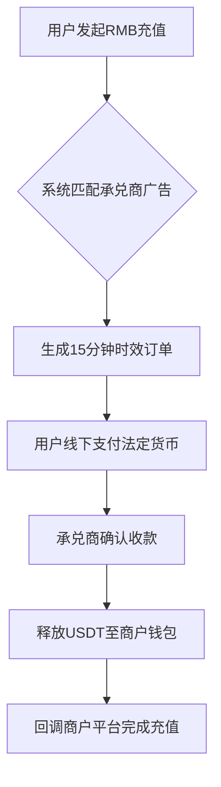

# USDT承兑商接单系统与区块链支付系统搭建全解析

## 一、USDT承兑系统运作机制详解
👉 [区块链支付系统搭建方案点击了解](https://bit.ly/okx_welcome)

USDT承兑系统通过数字化流程实现法币与加密货币的高效兑换，其核心运作机制包含以下关键环节：

1. **承兑商准入机制**
- 需预先在平台充值USDT作为信用保证金
- 支持发布个性化出售广告（可设置汇率/限额）
- 系统自动匹配商户订单需求

2. **交易执行流程**


3. **风险管控措施**
- 冻结承兑商保证金直至交易确认
- 超时未支付自动取消订单
- 双重校验资金流向（系统记录+链上确认）

## 二、区块链支付系统核心优势
👉 [全球领先数字资产平台解决方案](https://bit.ly/okx_welcome)

| 对比维度        | 传统跨境支付       | 区块链支付系统       |
|-----------------|------------------|--------------------|
| 交易手续费      | 4%-7%            | 0.5%-1%            |
| 结算时效        | 2-5个工作日      | 实时链上确认       |
| 风控体系        | 法币/币双轨风险  | 仅处理加密资产     |
| 接入门槛        | 需第三方支付牌照 | 全行业开放接入     |

系统特色功能：
- **多币种钱包管理**：支持BTC/ETH等20+主流币种统一管理
- **智能对账系统**：自动生成每日资产变动报告（支持API对接）
- **动态费率调整**：根据交易量阶梯式降低手续费

## 三、系统参与角色职能划分
👉 [数字资产解决方案专家咨询](https://bit.ly/okx_welcome)

### 1. 商户
- 核心价值：提供终端用户入口
- 收益模式：交易手续费分成（约0.3%-0.5%）
- 典型场景：游戏充值/电商支付/跨境结算

### 2. 承兑商
- 运作要点：
  - 需维持最低保证金（建议10万USDT起）
  - 每日处理量建议控制在50-200单
  - 利润空间：买卖价差+平台返佣

### 3. 代理商
- 拓展策略：
  ```python
  def calculate_commission(merchant_count, volume):
      base_rate = 0.05  # 基础佣金比例
      tier_bonus = 0.01 * merchant_count  # 每新增商户+1%
      volume_bonus = 0.005 if volume > 1e6 else 0  # 月交易超百万额外奖励
      return base_rate + tier_bonus + volume_bonus
  ```
- 重点区域：东南亚/中东等法币汇率波动较大市场

## 四、系统搭建技术要点

### 1. 架构设计
- 链上层：采用TRON网络（平均3秒出块）
- 应用层：微服务架构（Spring Cloud + Docker）
- 安全防护：双因子认证+冷热钱包分离

### 2. 接入流程
1. 提交营业执照/法人身份证明
2. 完成技术对接（提供标准API文档）
3. 测试环境联调（3-5个工作日）
4. 正式上线运营

### 3. 运营数据参考
某东南亚支付平台运营数据显示：
- 日均交易量：280万美元
- 用户留存率：82%（30天）
- 投诉率：0.17%（行业平均0.35%）

## 五、常见问题解答（FAQ）

**Q1：系统如何保障资金安全？**  
A：通过三重防护机制：1) 链上实时确认 2) 冷钱包存储90%资产 3) 24小时反洗钱监控系统

**Q2：跨境支付是否需要特殊资质？**  
A：系统仅处理加密资产，商户需自行确保法币交易合规性。建议在持牌离岸银行设立结算账户

**Q3：系统支持哪些开发语言对接？**  
A：提供多语言SDK（Python/Java/PHP/Node.js），并配备可视化API调试工具

**Q4：如何处理汇率波动风险？**  
A：采用动态汇率机制，每5分钟同步CoinMarketCap数据，支持设置价格保护区间

**Q5：代理商分成如何结算？**  
A：支持USDT或法币两种结算方式，月结周期可选（15日/30日），最低提现额100USDT

## 六、行业应用案例

**跨境电商解决方案**  
某深圳跨境电商平台接入系统后：
- 支付成功率从73%提升至96%
- 跨境结算成本降低68%
- 订单处理时效从小时级缩短至分钟级

**数字银行试点项目**  
中东某数字银行应用场景：
| 指标         | 接入前       | 接入后       |
|--------------|------------|------------|
| 用户开户周期 | 7-10工作日  | 实时开户    |
| 跨境手续费   | $15/笔      | $0.3/笔     |
| 投诉处理时效 | 3工作日      | 2小时内响应  |

## 七、系统升级路线图

2025年Q2重点升级计划：
- 集成AI反欺诈系统（预计降低风险事件40%）
- 上线移动端SDK（支持React Native开发）
- 接入DeFi流动性池（提升资产利用率）

通过持续的技术迭代与生态建设，USDT承兑系统与区块链支付平台正重塑全球支付格局，为企业提供更高效、安全、合规的数字化金融解决方案。