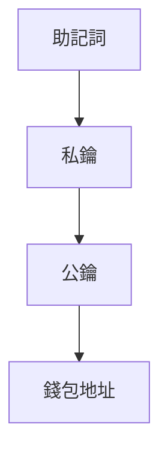

# 搞懂公鑰、私鑰、助記詞：一次釐清區塊鏈與加密貨幣的關鍵關係

在區塊鏈與加密貨幣領域，公鑰、私鑰、助記詞、鏈種與幣種存在緊密的技術關聯。本文將系統解析這些概念的內涵與交互關係，幫助讀者建立完整的知識框架。

## 核心概念解析

### 🔒 公鑰（Public Key）
公鑰由私鑰透過加密演算法（如橢圓曲線加密演算法 ECDSA）生成，其功能類似於銀行帳戶號碼：
- **主要用途**：生成數位錢包地址（接收資金）
- **安全特性**：可公開分享，但無法用於交易簽署
- **技術原理**：基於非對稱加密機制，確保交易驗證安全性

👉 [選擇安全錢包的關鍵指標](https://bit.ly/okx_welcome)

### 🔑 私鑰（Private Key）
作為數位資產控制的核心憑證：
- **核心功能**：簽署交易的唯一憑證
- **安全準則**：需採用冷存儲、多重備份等機制
- **風險警示**：遺失即永久失去資產控制權

### 🔠 助記詞（Mnemonic Phrase）
符合 BIP39 標準的私鑰備份方案：
- **組成結構**：12/15/18/21/24 個英文單詞序列
- **技術優勢**：人類可讀性高，支援 HD 錢包分層管理
- **保存建議**：建議使用物理介質離線保存

### 🔗 鏈種（Blockchain Type）
主流區塊鏈技術特徵對比：

| 鏈種       | 資料模型   | 共識機制   | 智能合約支持 |
|------------|------------|------------|--------------|
| 比特幣 BTC | UTXO 模型  | PoW        | 否           |
| 以太坊 ETH | 帳戶模型   | PoS        | 是           |
| Solana SOL | 帳戶模型   | PoH+PoS    | 是           |

### 💰 幣種（Cryptocurrency）
數位資產的發行與依存關係：
- **原生代幣**：BTC（比特幣鏈）、ETH（以太坊鏈）
- **協議代幣**：ERC-20（以太坊標準）、TRC-20（波場標準）
- **跨鏈現象**：USDT 同時存在於多條公鏈

---

## 技術交互關係

### 🔗 金鑰生成體系

### 📊 鏈與幣的對應邏輯
1. **資產歸屬**：ETH 僅能存放於以太坊地址
2. **跨鏈風險**：誤將 TRC-20 USDT 存入 ERC-20 錢包將導致資產凍結
3. **地址識別**：
   - BTC 地址以 `1`/`3`/`bc1` 開頭
   - ETH 地址以 `0x` 開頭

---

## 安全實務FAQ

### Q1：助記詞遺失後能否恢復資產？
A：若同時保留私鑰可實現恢復，但僅有助記詞遺失的情況下，資產將永久無法取回。

### Q2：如何驗證錢包地址與鏈種的匹配性？
A：建議使用區塊鏈瀏覽器核對地址格式，例如：
- Ethereum 鏈：etherscan.io
- Tron 鏈：tronscan.org

### Q3：多鏈錢包如何管理不同幣種？
A：採用 HD 錢包技術的分層管理方案，通過單一助記詞即可管理多鏈資產，如 OKX Wallet 支援 100+ 公鏈。

👉 [掌握專業錢包管理技巧](https://bit.ly/okx_welcome)

---

## 擴展應用場景

### 📈 數位資產管理策略
1. **冷熱錢包分離**：90% 資產存放冷錢包
2. **多簽署機制**：企業級資金管理必備方案
3. **定期審計**：透過區塊鏈瀏覽器驗證資產流動

### 🌐 跨鏈技術演進
- **原子交換**：實現無中介的跨鏈交易
- **中繼鏈方案**：Polkadot 的平行鏈架構
- **Layer2 擴展**：Optimism 的跨鏈橋接技術

---

## 常見誤區警示

| 錯誤認知                | 正確觀念                |
|-------------------------|-------------------------|
| 公鑰可發起交易          | 僅私鑰具備交易簽署權限  |
| 所有 USDT 都能互通      | TRC-20 與 ERC-20 不相容 |
| 助記詞長度越長越安全    | 符合 BIP39 標準即可     |

👉 [避免新手常見錯誤指南](https://bit.ly/okx_welcome)

---

## 技術演進趨勢
2025 年度加密技術發展重點：
1. **量子抗性演算法**：NIST 標準化進程加速
2. **Soulbound Tokens**：不可轉讓 NFT 的應用擴展
3. **零知識證明**：ZK-Rollups 技術的規模商用

通過理解這些核心概念與技術關係，投資者與開發者能更安全有效地參與區塊鏈生態建設。記住：數位資產安全管理的第一原則是「私鑰永不離手，助記詞嚴格保密」。